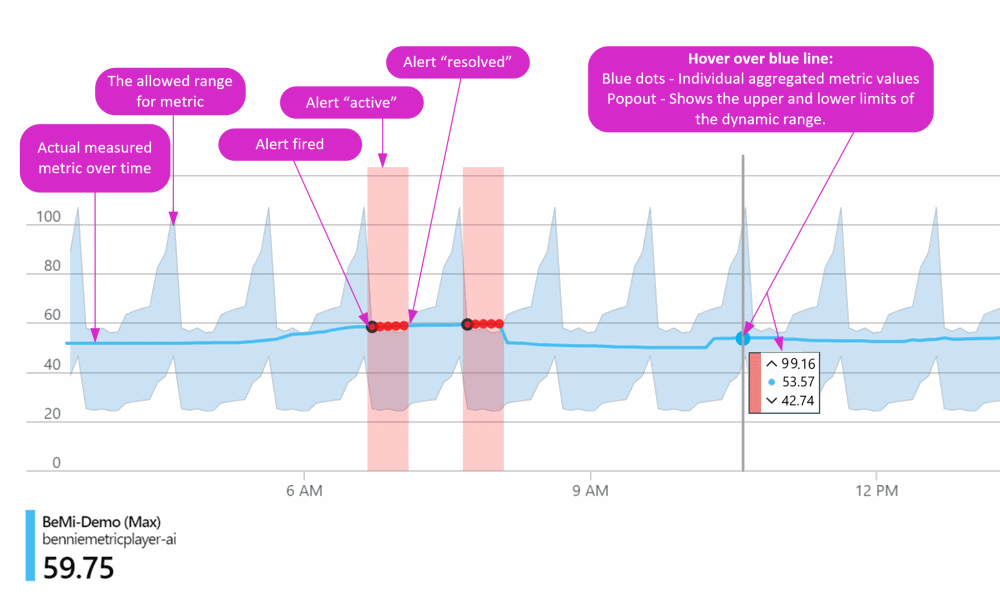
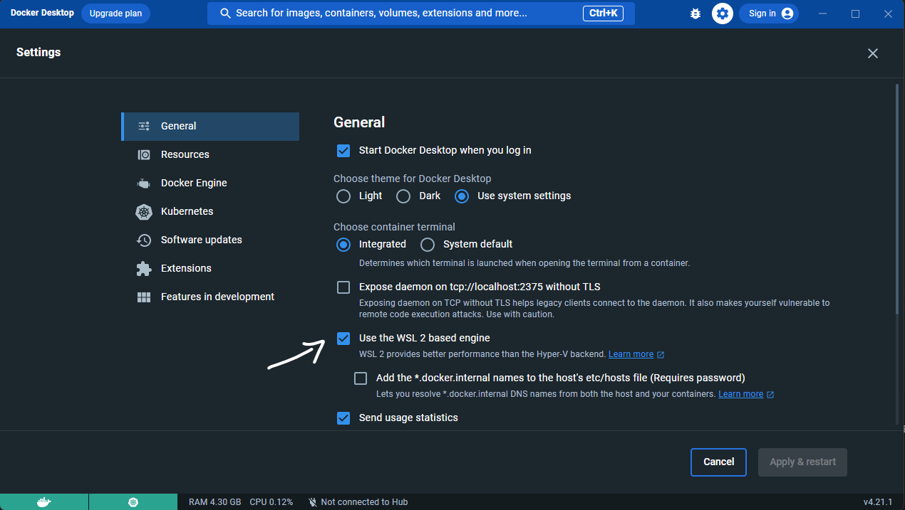
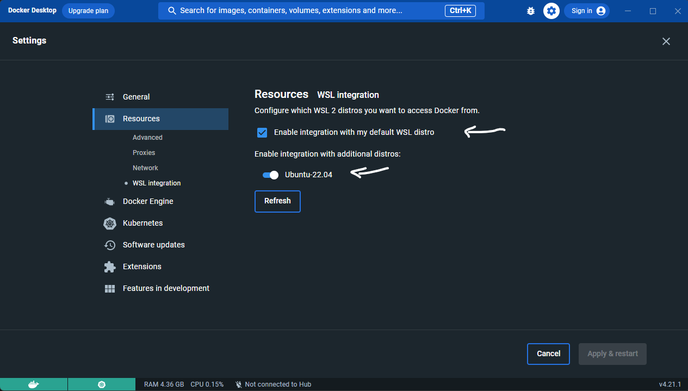
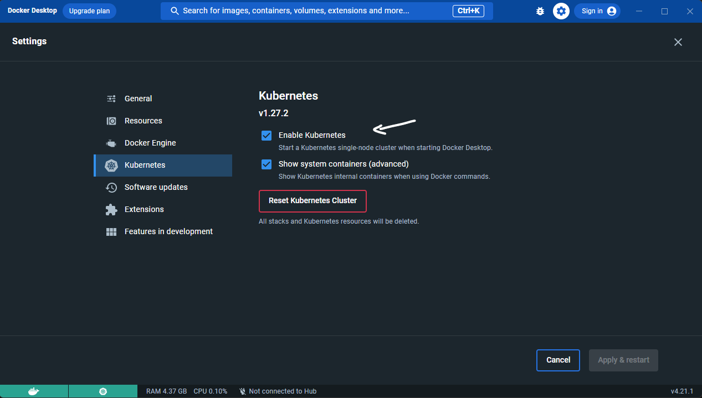

# Devops Guidelines

The Uniphar Group targets the Azure cloud for most of the cloud workloads.
The technical stack and tooling is around that expected for an Azure
execution and we do not use any cloud agnostic tools like Terraform because we
design infrastructure specifically to maximize performance and cost optimization
in Azure.

This document goes through the list of tools, technologies, processes and
principles to we use in DevOps within the Uniphar group and should be used as a
reference to what is expected to be seen on the internal repositories that
contain final DevOps infrastructure as code.

**Note**
If Installing from scratch, you might want to check the [Quick Setup](#quick-setup)
 guide

## Technology Stack

### Code

We use a mix of [PowerShell Core](https://github.com/PowerShell/PowerShell) using
the [Az](https://www.powershellgallery.com/packages/Az/10.1.0) modules combined with
[bicep](https://github.com/Azure/bicep) for the actual resource definition in
Azure. We're no longer doing anything with
[ARM Templates](https://docs.microsoft.com/en-us/azure/azure-resource-manager/templates/overview)
directly, instead everything is declared in the newer and much more readable
[bicep](https://github.com/Azure/bicep) templates.

Both PowerShell Core and bicep are on the latest versions. We continuously update
our development environments to match the rapid pace of updates that are done on
hosted build agents.

In the cases where we're developing automation against either Azure DevOps or
Github we use their corresponsing CLIs called through PowerShell code:

- [Github CLI](https://github.com/cli/cli)
- [Az Azure DevOps CLI](https://github.com/Azure/azure-devops-cli-extension)

Example bicep template for a multi region cosmos account:

```bicep
param accountName string
param locations array

resource cosmosDb 'Microsoft.DocumentDB/databaseAccounts@2021-10-15' = {
  name: accountName
  kind: 'GlobalDocumentDB'
  location: locations[0]
  properties: {
    consistencyPolicy: {
      defaultConsistencyLevel: 'Session'
    }
    locations: [for (location, i) in locations: {
        locationName: location
        failoverPriority: i
        isZoneRedundant: false
      }]
    databaseAccountOfferType: 'Standard'
    enableAutomaticFailover: true
    enableMultipleWriteLocations: true
  }
}
```

Example PowerShell function to deploy DNS:

```PowerShell
function Initialize-Dns
{
    [CmdletBinding(SupportsShouldProcess)]
    Param(
        [parameter(Mandatory = $true, Position = 0)]
        [string] $Location
    )

    $webTemplateFile = Join-Path $PSScriptRoot -ChildPath ".\dns.bicep"
    $resourceGroupName = 'mypublic-dns'
    $publicDns = 'mypublicdns.com'
    $privateDns = 'mypublicdns.clocal'

    if($null -eq (Get-AzResourceGroup $resourceGroupName -ErrorAction SilentlyContinue)) {
        New-AzResourceGroup $resourceGroupName -Location $Location
    }

    if($PSCmdlet.ShouldProcess('DNS', 'Deploy')) {
        New-AzResourceGroupDeployment -Mode Incremental `
                                      -ResourceGroupName $g_dnsResourceGroupName `
                                      -TemplateFile $webTemplateFile `
                                      -dnsZone $publicDns `
                                      -privateDnsZone $privateDns `
                                      -Verbose
    }
    else {
        $testRg = New-Guid
        New-AzResourceGroup $testRg -Location $Location -WhatIf:$false > $null

        $TestResult = Test-AzResourceGroupDeployment -Mode Incremental `
                                                     -ResourceGroupName $testRg `
                                                     -TemplateFile $webTemplateFile `
                                                     -dnsZone $publicDns `
                                                     -privateDnsZone $privateDns `
                                                     -Verbose

        Remove-AzResourceGroup $testRg -WhatIf:$false -Force -Confirm:$false > $null

        if ($TestResult) {
            $TestResult
            throw "The deployment for DNS did not pass validation."
        }
    }
}
```

- We use `-WhatIf` to test the template, and that is then plugged into CI builds.
- During the `-WhatIf` branch we create a random _GUID_ Resource Group to use the
  same deployment type that we then delete after the test is complete.
- We always deploy in `Incremental` outside special development loops to use the
  idempotency mechanism built into the Azure ARM API.
- What we call deployment blocks are wrapped into functions -> Think of a deployment
  block as a unit that goes through a single CD pipelines across multiple stages.

### Azure commands

We use the [Az](https://www.powershellgallery.com/packages/Az/7.2.0) modules
over the [Azure CLI](https://github.com/Azure/azure-cli), due to it's easier use
through the PSObject stack as oposed to parsing JSON in the case of using the
Azure CLI through PowerShell.

## DevOps Principles

### Infrastructure as Code

Infrastructure as Code (IaC) is the management of infrastructure in a
descriptive model, using the same versioning as DevOps team uses for source code.
Like the principle that the same source code generates the same binary, an IaC
model generates the same environment every time it is applied. IaC is a key
DevOps practice and is used in conjunction with continuous delivery, pull
requests and trunk based development.

### Build Measure Learn

Build-Measure-Learn is one of the central principles of Lean Startup –
a highly effective approach to startup development pioneered by Eric Ries.

In practice, the model involves a cycle of creating and testing hypotheses by
building something small for potential customers to try, measuring their
reactions, and learning from the results. The aim is to continuously improve
your product/platform so that you eventually deliver precisely what your
customers want.

We apply this to most projects we commit to, where we often start on our first
good hypothesis to solve a problem, build it and if that's not the solution
(by measuring) we learn for the experience and move to another hypothesis,
repeat until we find the right solution.

### Fail Fast

This is a software development principle where developers align their
applications to fail right away in a visible fashion in order to reduce the
amount of hidden bugs over time.

When applied to DevOps, we align our code base as a lean code base so that we
run through iterations very quickly, either a new piece of infrastructure
(new code) or changes to an existing one (refactoring/changing existing code),
by keeping the code base lean and having all DevOps code under CI/CD, our cycle
to deploying to early environments is quite fast.

### Observe everything

We use the following telemetry platforms:

- [Log Analytics](https://docs.microsoft.com/en-us/azure/azure-monitor/logs/log-analytics-overview)
- [Application Insights](https://docs.microsoft.com/en-us/azure/azure-monitor/app/app-insights-overview)
- [Azure Data Explorer](https://docs.microsoft.com/en-us/azure/data-explorer/data-explorer-overview)

We collect telemetry for as much as we can, from routing all diagnostic settings
for Azure resources for events and metrics to collecting Kubernetes logs.
It is a critical aspect of everything we do in the cloud.

We then use the Azure Monitor stack to implement alerts, action groups and
paging functionality on alert triggers.

### Deviation monitors over static monitors

We alert mostly on deviation alerts, either **static deviation alerts**:
_Is the error rate higher then 5%?_ or
**dynamic threshold alerts** for events that don't necessarly need actions right
away:



## CI/CD pipelines

Devops code is deployed through [github actions](https://docs.github.com/en/actions),
using yaml workflows. We run a CI workflow that mostly calls initialization
blocks using `-WhatIf`, that internally run sets of `Test-AzResourceGroupDeployment`.

> **TODO: Example pipeline**

## DevOps project structure

Each DevOps project is structured as a PowerShell module, and every function
that is exported is documented, and in some cases functions that aren't exported
are also documented. The module contains one manifest file `.psd1` and one
module file `.psm1`.

The `.psm1` module file acts as an agregator of all the files that contain
functions and is responsible for exporting functions. So we don't use the
manifest `FunctionsToExport` to define what gets exported or not, but instead
export everything with `FunctionsToExport = '*'` and then control the export in
the `.psm1`:

```powershell
# Import functions
. "$PSScriptRoot\stuff\Initialize-Stuff.ps1"
. "$PSScriptRoot\somestuff\Initialize-SomeStuff.ps1"

# Export functions
Export-ModuleMember -Function @(

    'Initialize-Stuff'
    'Initialize-SomeStuff'

)
```

## Tooling

### IDE

IDEs are mostly development flavours, and we don't enforce anything particular
as long as code follows the same standards, however we mostly use [VSCode](https://code.visualstudio.com/)
to write the PowerShell modules and any bicep templates in them. Below is a list
of VSCode extensions that we use often.

### IDE extensions

- [Bicep](https://marketplace.visualstudio.com/items?itemName=ms-azuretools.vscode-bicep)
- [Bridge to Kubernetes](https://marketplace.visualstudio.com/items?itemName=mindaro.mindaro)
- [Code Tour](https://marketplace.visualstudio.com/items?itemName=vsls-contrib.codetour)
- [Docker](https://marketplace.visualstudio.com/items?itemName=ms-azuretools.vscode-docker)
- [Github](https://marketplace.visualstudio.com/items?itemName=GitHub.vscode-pull-request-github)
- [Gitlens](https://marketplace.visualstudio.com/items?itemName=eamodio.gitlens)
- [Kubernetes](https://marketplace.visualstudio.com/items?itemName=ms-kubernetes-tools.vscode-kubernetes-tools)
- [Live Share](https://marketplace.visualstudio.com/items?itemName=MS-vsliveshare.vsliveshare)
- [Markdown All in One](https://marketplace.visualstudio.com/items?itemName=yzhang.markdown-all-in-one)
- [markdownlint](https://marketplace.visualstudio.com/items?itemName=DavidAnson.vscode-markdownlint)
- [PowerShell](https://marketplace.visualstudio.com/items?itemName=ms-vscode.PowerShell)
- [YAML](https://marketplace.visualstudio.com/items?itemName=redhat.vscode-yaml)

### Package Managers

Most CLIs and aditional tools like bicep, we update them through package managers,
and we aim at keeping everything updated to the latest at all times.

One package manager that supports most of our toolset is [chocolatey](https://chocolatey.org/).
But others like [scoop](https://scoop.sh/) or [winget](https://docs.microsoft.com/en-us/windows/package-manager/winget/)
can also be used. They just facilitate keeping things updated very easily.

### CLIs

We use the following CLIs:

- [Azure CLI](https://github.com/Azure/azure-cli)
- [Github CLI](https://github.com/cli/cli)
- [Az Azure DevOps CLI](https://github.com/Azure/azure-devops-cli-extension)
- [Kubectl](https://kubernetes.io/docs/tasks/tools/#kubectl)
- [Helm](https://helm.sh/docs/intro/install/)

### Quick Setup

If you want to go with the reccommended setup follow the next steps.

## Install Powershell

Start by installing
[Powershell Core](https://learn.microsoft.com/en-us/powershell/scripting/install),
 select your OS and follow the instructions.

## Install Chocolatey

Install [Chocolatey](https://chocolatey.org/install) by running the following command
 in an elevated PowerShell (run as administrator) window:

```powershell
Set-ExecutionPolicy Bypass -Scope Process -Force; [System.Net.ServicePointManager]::SecurityProtocol = [System.Net.ServicePointManager]::SecurityProtocol -bor 3072; iex ((New-Object System.Net.WebClient).DownloadString('https://community.chocolatey.org/install.ps1'))
```

After installation, restart your PowerShell session (run as administrator) and run
 the following command.
  
  ```powershell
  choco install az.powershell azure-cli bicep gh git minikube kubernetes-helm NSwagStudio nvm yarn kubernetes-cli
  ```

Additionally you can install VS Code and the following extensions:

  ```powershell
  choco install vscode vscode-powershell vscode-docker vscode-markdownlint vscode-yaml vscode-kubernetes-tools vscode-pull-request-github vscode-vsliveshare vscode-gitlens vscode-csharp vscode-markdown-all-in-one
  ```

## Install Code Extensions

Some extensions are not available through Chocolatey, so you need to install
 them manually:

```powershell
code --install-extension ms-azuretools.vscode-bicep
code --install-extension mindaro.mindaro
code --install-extension vsls-contrib.codetour
```

## Windows Subsystem for Linux

Follow the steps on
 [Install Linux on Windows with WSL](https://learn.microsoft.com/en-us/windows/wsl/install)
  to install WSL2.
If you're not used to a distribution, one of the most used is Ubuntu.

## Docker Desktop

Once you have WSL2 installed, you can run the following command on a powershell
 terminal with elevated privileges:
  
  ```powershell
  choco install docker-desktop
  ```

  After Installation, Ensure the following options are selected

  
  
  

## Utils

### Kubernetes

#### Kubectl Autocomplete

To enable autocomplete for kubectl, run the following command:

```powershell
kubectl completion powershell | Out-String | Invoke-Expression
```
