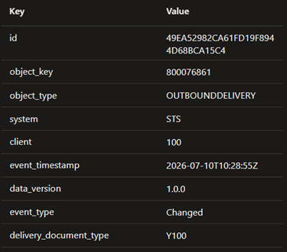

# SAP Eventing Framework

## Overview

Uniphar has built a series of configurable components that allown us to send
events for SAP transactions to Service Bus, so that other consumers can act on
these events without having to pool the SAP systems.

## ABAP SAP module - Eventing Framework

At the core of these components we have a custom ABAP framework that listens to
pre-configured SAP transactions (from a configuration table) and produces a ServiceBus
message with customizable payloads (from another configuration table).

To facilitate consumption of these events, this framework has configurable message
headers that are also duplicated in the payload, but they facilitate the creation
of SQL filters when subscribing to topics that have these SAP events.

### Example message

``` json
[
    {
        "id": "49EA52982CA61FD19F8944D68BCA15C4",
        "objectKey": "0800076861",
        "objectType": "OUTBOUNDDELIVERY",
        "system": "STS",
        "client": "100",
        "eventTimestamp": "2026-07-10T10:28:55Z",
        "dataVersion": "1.0.0",
        "eventType": "Changed",
        "deliveryDocumentType": "Y100",
        "data": {
            "deliveryDocument": "0800076861",
            "sdDocumentCategory": "J",
(...)
            "toExtension": {
                "deliveryDocument": "0800076861",
                "zz1ShippointnameDlh": ""
            },
            "toItem": [
                {
                    "deliveryDocument": "0800076861",
                    "deliveryDocumentItem": 10,
                    "sdDocumentCategory": "J",
(...)
                }
            ]
        }
    }
}
```

The JSON properties at the root level of the message are also sent as message headers
as a list of key value pairs.



They contain the main properties that identify the type of event and we send them
as message headers so that SQL filters can be created easily on the topic subscriptions

### Message Headers

- __object_key__ - The SAP identifier for this event
- __object_type__ - The type of the SAP event
- __system__ - The name of the SAP system
- __client__ - The name of the SAP client in the SAP system. Some systems have
  multiple clients
- __data_version__ - The version of the JSON payload schema
- __event_type__ - The type of action that was performed - New, Changed, Deleted,
  etc.

## Large Message Payloads

Some events will be to large to send to the Topic with their full payload. When
the eventing framework receives an `413: Entity too large` status code from the
Service Bus, it will strip out all arrays in the `data` object, set them to `null`
and add an aditional header to the message `blobUri`. This header will contain
the full URI for a JSON blob that contains the full payload.

### Example Large Message stripped

Using the same example as given above, but in a stripped version where instead of
having the full `toItem` array in the message payload, we now set it to `null`.

``` json
[
    {
        "id": "49EA52982CA61FD19F8944D68BCA15C4",
        "blobUri": "https://unidawntest.blob.core.windows.net/ibp/MB52_01042026.json"
        "objectKey": "0800076861",
        "objectType": "OUTBOUNDDELIVERY",
        "system": "STS",
        "client": "100",
        "eventTimestamp": "2026-07-10T10:28:55Z",
        "dataVersion": "1.0.0",
        "eventType": "Changed",
        "deliveryDocumentType": "Y100",
        "data": {
            "deliveryDocument": "0800076861",
            "sdDocumentCategory": "J",
(...)
            "toExtension": {
                "deliveryDocument": "0800076861",
                "zz1ShippointnameDlh": ""
            },
            "toItem": null
        }
    }
}
```

## Consuming Large Messages

As a client, if you need data that is in a stripped array on a large message
(identified by having the `blobUri` header), you will have to retrieve the
message blob and parse that instead of the Service Bus message. We will be
injecting the key to the storage account where we store the large messages
into the application KeyVault as `AzureStorage--LargeMessageKey`.

The storage account container will have a 30 day expiration policy, and
will automatically delete the payloads after 30 days. We consider this enough
time to go through any retry policies or errors.
